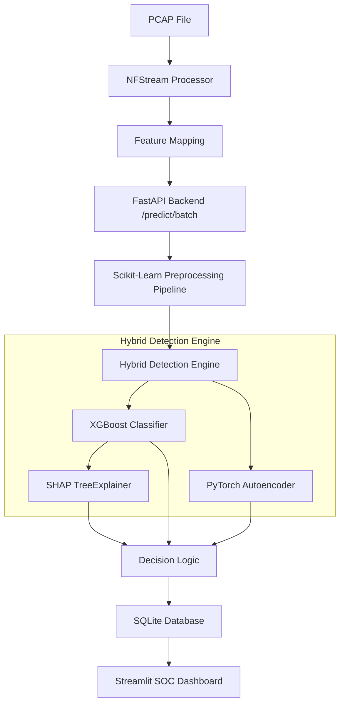

# Platform Architecture

## High-Level Flow

## Component Details

### 1. Packet Processing (`nids/packet/pcap_processor.py`)
Extracts bidirectional flow statistics using NFStream, mapping raw PCAP packets into 78 statistical features (e.g., Flow Duration, Packet Lengths, Flags).

### 2. Preprocessing (`ml/preprocessing/pipeline.py`)
A Scikit-Learn `ColumnTransformer` that:
- Imputes missing numerical values (medians).
- Scales distributions (`StandardScaler`).
- Strips leaky features before passing data to the models.

### 3. Machine Learning Core (`nids/detection/hybrid_engine.py`)
- **Supervised**: XGBoost optimized for high precision on known classes.
- **Unsupervised**: PyTorch Autoencoder measuring reconstruction error (MSE). High MSE flags zero-day anomalies.

### 4. API & Database (`app/`)
- Built with FastAPI for async-capable HTTP routing.
- Validates all input via Pydantic schemas (`app/models/schemas.py`).
- Saves alerts to SQLite using SQLAlchemy ORM.

### 5. UI (`dashboard/app.py`)
- Streamlit application displaying real-time database polling, Plotly charts, and raw JSON SHAP explanations for analysts.
